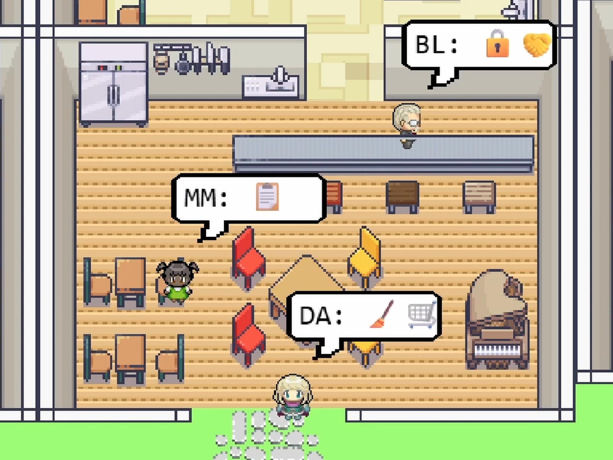

# Agentic LLM Course — Case Study 4: Simulating Societies with LLM Agents

Course materials for Case Study 4 of the Agentic LLM course at LIACS, Leiden University.

  

This case study draws on the generative agents simulation at [fvdveen/generative_agents](https://github.com/fvdveen/generative_agents), based on the work described in *"Good Agent Gone Bad: When 'Bad is Stronger Than Good' in the Memory of Generative Agents"* (van der Veen, Moravčíková & van Duijn, 2026).

## Getting Started

1. **Read the [Course Guide](course/COURSE_GUIDE.md)** — this is your main reference. It contains setup instructions, all four exercises, and the submission checklist.
2. **Clone the simulation repo** — follow the setup instructions in the course guide to get the simulation running.
3. **Download the [Answer Template](course/answer_template.md)** — fill this in as you work through the exercises. This is what you submit.

## Contents

| File | Description |
|------|-------------|
| [COURSE_GUIDE.md](course/COURSE_GUIDE.md) | Step-by-step exercise instructions, setup guide, and submission checklist |
| [answer_template.md](course/answer_template.md) | Template to fill in and submit with your answers, log excerpts, and plots |
| [rubric.md](course/rubric.md) | Grading criteria for each exercise |

## Requirements

- **Go 1.24.3+** (to run the simulation server — you will not write any Go code)
- **Python 3.10+** with `pandas`, `matplotlib`, `scipy`
- **Two different LLMs** (at least one commercial API, one local/open recommended)

See the [Course Guide](course/COURSE_GUIDE.md) for full setup details.
